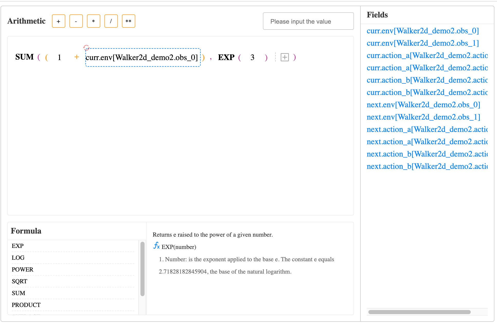

```
npm install
npm run dev
```



Methods

| 方法          | 说明                     | 返回值                                                |
| ------------- | ------------------------ | ----------------------------------------------------- |
| init          | 初始化 参数见 attributes | Promise                                               |
| getValue      | 获取公式                 | {type: "success, InvalidParams", value: Object, null} |
| setFieldValue | 给公式增加选中的值       | void                                                  |
| clear         | 清空公式                 | void                                                  |

Init Attributes

| 参数            | 类型   | 说明                                               |
| --------------- | ------ | -------------------------------------------------- |
| defineFunctions | object | 自定义公式按钮，修改公式说明、样式，详细格式见下方 |
| initialValue    | object | 公式初始值                                         |
| width           | string | 公式生成器宽度                                     |
| prohibitInput   | boolean | 禁止输入框输入                             |

```
|
src
|----assets                           
|      |----css                                // 样式
|      |----svg-icon                           // svg-icon
|----config                                   
|      |----define-token.js                    // 定义token类型
|      |----function-types                     // 函数类型的token配置项
|----lib                                  
|      |----formula                            // formula-builder工具封装
|              |----bus.js                     // 发布订阅
|              |----fml.js                     // 算术、函数、token的入口文件
|              |----index.js                   // formula-builder的方法
|              |----token-arithmetic.js        // 算术token方法
|              |----token-func.js              // 函数token方法
|              |----token.js                   // token公共方法
|      |----i18n                               // 国际化
|----packages                                   
|      |----formula                            // 公式
|              |----src                        
|                    |----arithmetic-item.vue  // 算术token组件，隶属formula-item
|                    |----formula-item.vue     // 公式主组件
|                    |----index.scss           // 样式
|                    |----index.vue            // 公式入口文件，提供对外的方法
|                    |----param-item.vue       // 参数token组件，隶属formula-item
|              |----index.js                   // 组件入口 
|      |----formula-preview                    // 公式预览组件
|      |----input                              // input组件        
|      |----select                             // 下拉框组件
|      |----utils                              // 工具库
|      |----index.js                           // 项目入口，注册vue全局组件
.prettierrc.js                                 // 格式化 
.gitignore                                     // git上传忽略文件
package.json                                   // 项目配置文件
package.lock                                   // 项目配置文件锁
README.md                                      // 项目说明文档
|
```
